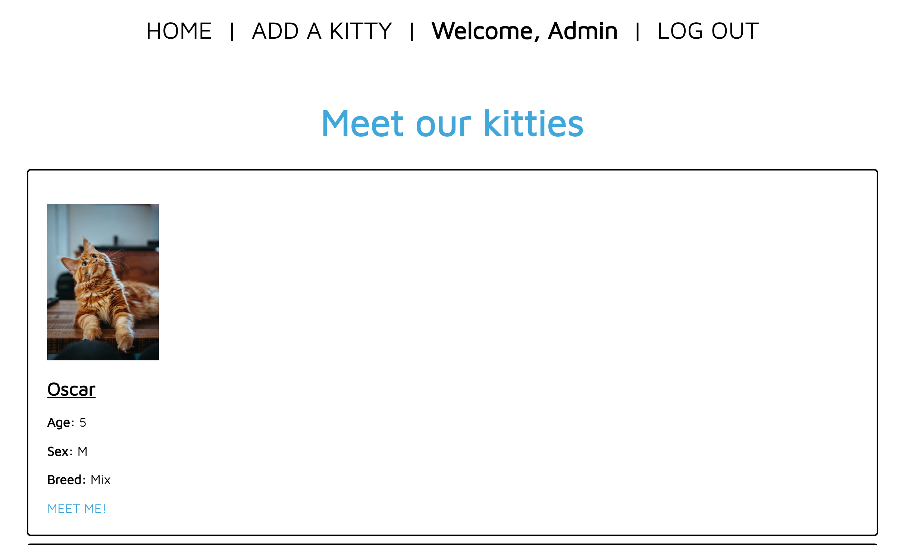
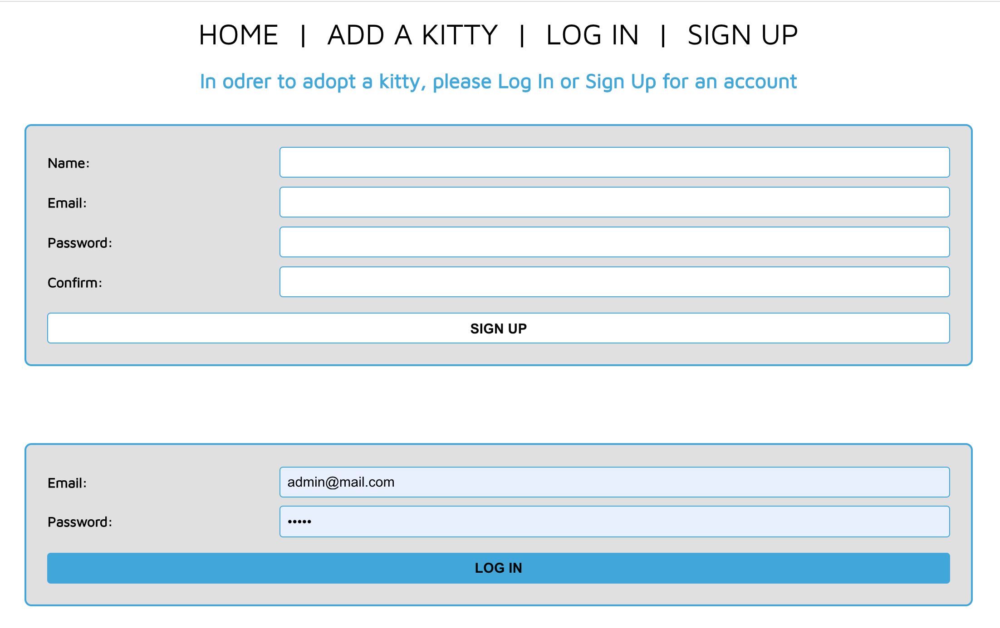
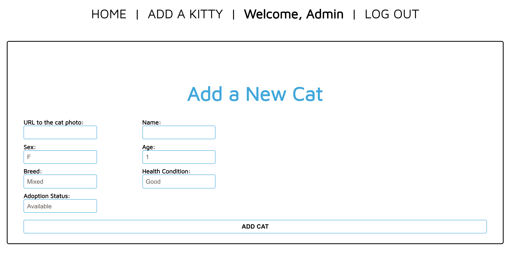

# CatApp 2.0

CatApp 2.0 is a refactor of Happy Paws- a cat adoption app where users can view all cats currently up for adoption. The app uses token-based authentication for Signing Up new users and Logging existing users In/Out. Authorization is implemented on the Admin account that gives only the Administrator the ability to add, update, and delete cat posts.

####Technologies Used: 
The app was built with MERN stack. MongoDB/Mongoose, Express, React. Node.js

#### Getting Started: 

[CatApp 2.0](https://cat-app-2.herokuapp.com/cats)  
[CatApp 2.0 project's Trello Board](https://trello.com/b/PrmAd16B/catapp20-mern-stack)

####Planned future enhancements:

* Minor bug fixes
* Making it possible for the user to "fast apply" for a cat they'd like to adopt by clicking a single button instead of filling out an application form. Their registration info would then be saved into an "application account" and the Admin would be able to see if the applicant is eligible to adopt, making the process easy for both, user and Admin.
* Adding a donation feature where users could donate items cats are in need of.
* Styling for a more polished look.